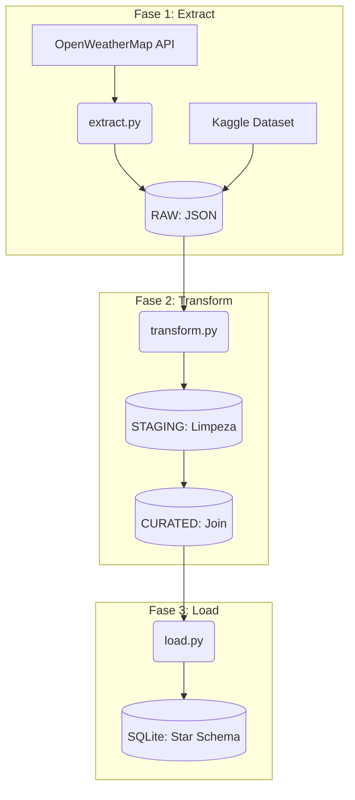
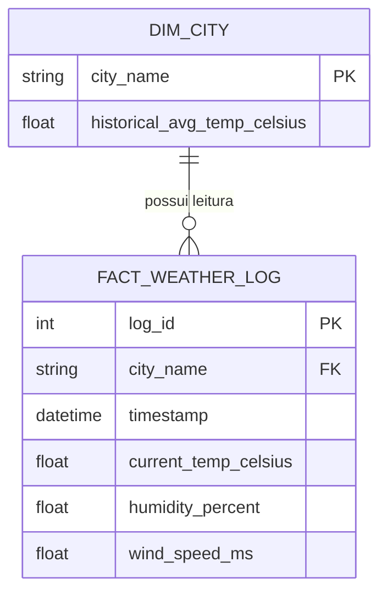

# Projeto Prático de ETL: Monitorização Climática

Este repositório contém a implementação de um pipeline modular de Engenharia de Dados (Extract, Transform, Load - ETL) focado no domínio do Clima e Meio Ambiente. 

**Módulo Atual:** Semana 3 - Carregamento (Load) e Modelação de Dados.

## Inventário das Fontes de Dados

Para cumprir os requisitos de diversidade e volume, o projeto utiliza duas fontes primárias:

1. **OpenWeatherMap API (Tempo Real):** Extração dinâmica de dados meteorológicos atuais (temperatura, vento, pressão, humidade). Os dados são consumidos com uma política de *retries* (Exponential Backoff) para evitar limites de taxa.
2. **Kaggle Earth Surface Temperature Data (Histórico / Grande Volume):** Dataset massivo (ficheiro `GlobalLandTemperaturesByCity.csv`, >500MB) contendo o registo histórico climático. 
   * *Nota Técnica:* Devido ao limite de 100MB do GitHub, este ficheiro de alto volume foi adicionado ao `.gitignore` e não consta no repositório remoto. Uma amostra representativa (`sample_temperatures.csv`) é utilizada na fase de transformação para cruzamento de chaves e validação do pipeline.

## Pré-Requisitos e Configuração (Setup)

O projeto foi desenhado para ser totalmente reproduzível num computador pessoal. 

1. **Clonar o repositório e aceder à pasta:**
   ```bash
   git clone https://github.com/davgomes92/projeto_etl.git
   cd projeto_etl
   ```

2. **Configurar Variáveis de Ambiente:**
   Crie um ficheiro `.env` na raiz do projeto (use o `.env.example` como base) e insira a sua API Key do OpenWeatherMap:
   ```text
   OPENWEATHER_API_KEY=sua_chave_aqui
   ```

3. **Criar e Ativar o Ambiente Virtual:**
   ```bash
   python3 -m venv venv
   source venv/bin/activate  # Em macOS/Linux
   # venv\Scripts\activate   # Em Windows
   ```

4. **Instalar Dependências:**
   ```bash
   pip install -r requirements.txt
   ```

## Como Executar o Pipeline Completo

O pipeline está dividido em módulos sequenciais. Garanta que o seu ambiente virtual está ativo e as dependências instaladas.

**1. Fase de Extração (Extract):**
```bash
python extract.py
```
*Gera os ficheiros brutos (JSON) na pasta `data/raw/` consumindo a API em tempo real.*

**2. Fase de Transformação (Transform):**
```bash
python transform.py
```
*Lê os dados brutos, aplica regras de qualidade (limpeza de nulos, normalização de strings), integra as fontes (API + Kaggle) e gera as tabelas analíticas nas pastas `data/staging/` e `data/curated/`.*

**3. Fase de Carregamento (Load):**
```bash
python load.py
```
*Lê os ficheiros da camada Curated e carrega-os para uma base de dados relacional local (`data/database.sqlite`) utilizando uma arquitetura Star Schema. No final, executa validações automáticas de integridade.*

## Diagramas da Arquitetura e Modelação

### Arquitetura do Pipeline


### Modelo Entidade-Relacionamento (ERD)

