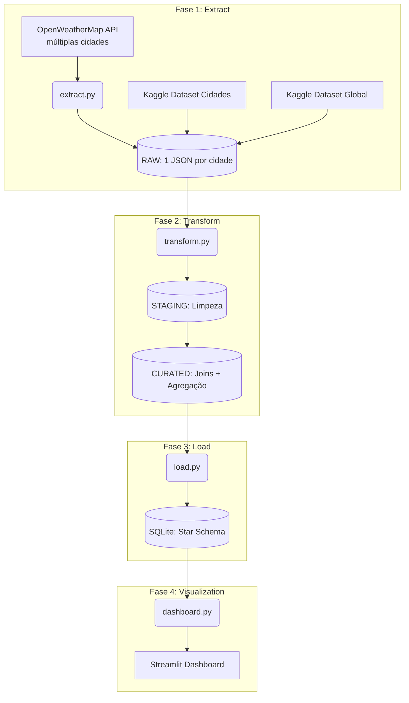
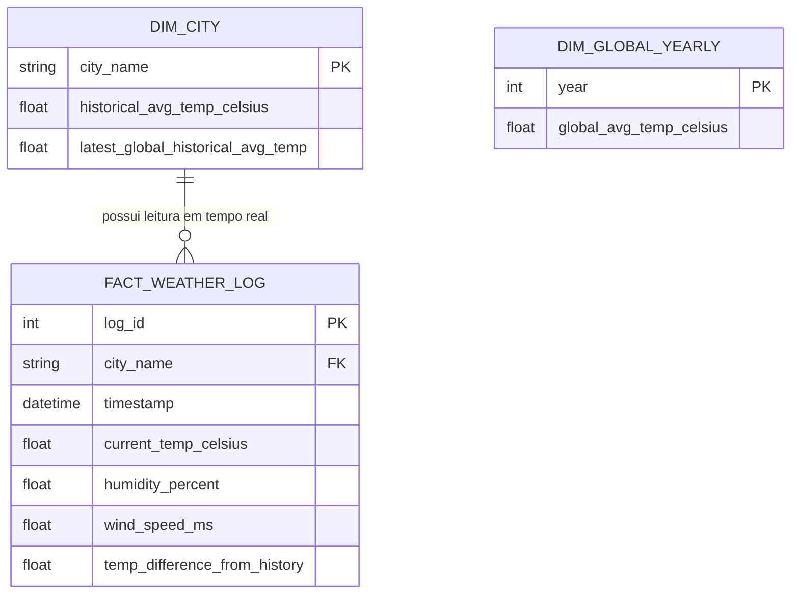

# Projeto Prático de ETL: Monitorização Climática

Este repositório contém a implementação de um pipeline modular de Engenharia de Dados (Extract, Transform, Load - ETL) focado no domínio do Clima e Meio Ambiente. O objetivo principal é responder a perguntas analíticas sobre o aquecimento local das cidades em contraste com tendências globais.

**Módulo Atual:** Semana 4 - Visualização (Visualization) e Entrega Final.

## Contexto e Perguntas Analíticas

O projeto procura responder às seguintes questões:
* Como a temperatura atual de uma cidade (em tempo real) se compara com a sua média histórica secular?
* É possível observar um desvio térmico (anomalia) consistente com a métrica de aquecimento global, e como evoluiu esse aquecimento global ao longo do tempo?
* Como se compara o desvio térmico entre diferentes cidades, na mesma leitura?
* Existe correlação visível entre indicadores meteorológicos (ex: vento vs. humidade) nas leituras recentes?

## Inventário das Fontes de Dados (3 Fontes)

Para cumprir os requisitos de diversidade, volume e enriquecimento de dados, o projeto utiliza três fontes:

1. **OpenWeatherMap API (Tempo Real):** Extração dinâmica de dados meteorológicos atuais (temperatura, vento, pressão, humidade) para uma lista de várias cidades (`TARGET_CITIES` em `extract.py`). Os dados são consumidos com uma política de *retries* (Exponential Backoff) via `tenacity` para gerir limites de taxa, e a falha numa cidade não interrompe a extração das restantes.
2. **Kaggle Earth Surface Temperature Data (Histórico / Grande Volume):** Dataset massivo (ficheiro `GlobalLandTemperaturesByCity.csv`, >500MB) contendo o registo histórico climático das cidades.
   * *Nota Técnica:* Devido ao limite de 100MB do GitHub, este ficheiro de alto volume foi adicionado ao `.gitignore` e não consta no repositório remoto. Uma amostra representativa (`sample_temperatures.csv`), com as mesmas cidades usadas em `TARGET_CITIES`, é utilizada na fase de transformação para cruzamento de chaves e validação do pipeline.
3. **Kaggle Global Temperatures (Fonte Complementar):** Ficheiro `GlobalTemperatures.csv` com as médias climáticas globais terrestres. A série anual completa é preservada (não apenas o ano mais recente) e carregada na sua própria tabela (`dim_global_yearly`), permitindo visualizar a evolução do aquecimento global ao longo de todo o histórico disponível.

## Pré-Requisitos e Configuração (Setup)

O projeto foi desenhado para ser totalmente reproduzível num computador pessoal, sem necessidade de infraestruturas Cloud.

1. **Clonar o repositório e aceder à pasta:**
   ```bash
   git clone https://github.com/davgomes92/projeto_etl.git
   cd projeto_etl
   ```

2. **Configurar Variáveis de Ambiente:**
   Crie um ficheiro `.env` na raiz do projeto (use o `.env.example` como base) e insira a sua API Key do OpenWeatherMap:
   ```text
   OPENWEATHER_API_KEY=sua_chave_aqui
   ```

3. **Criar e Ativar o Ambiente Virtual:**
   ```bash
   python3 -m venv venv
   source venv/bin/activate  # Em macOS/Linux
   # venv\Scripts\activate   # Em Windows
   ```

4. **Instalar Dependências:**
   ```bash
   pip install -r requirements.txt
   ```

## Como Executar o Pipeline Completo

O pipeline adota uma Arquitetura Medallion (Raw -> Staging -> Curated) e um fluxo de módulos sequenciais.

**1. Fase de Extração (Extract - Semana 1):**
```bash
python extract.py
```
*Percorre a lista de cidades definida em `TARGET_CITIES` e, para cada uma, consome a API em tempo real, gerando um ficheiro JSON por cidade na pasta `data/raw/`. Falhas numa cidade são registadas em log e não interrompem as restantes.*

**2. Fase de Transformação (Transform - Semana 2):**
```bash
python transform.py
```
*Lê todos os ficheiros JSON da última execução do `extract.py` (uma cidade por ficheiro), aplica regras de qualidade (limpeza de nulos, normalização de strings, datetime casting) e integra as três fontes (API + Kaggle Cidades + Kaggle Global) através de joins e agregações anuais, gerando a tabela analítica final nas pastas `data/staging/` e `data/curated/`. A série anual global completa é preservada em `data/staging/global_historical_clean.csv` para ser carregada na íntegra na fase seguinte.*

**3. Fase de Carregamento (Load - Semana 3):**
```bash
python load.py
```
*Carrega a camada Curated para um modelo dimensional (SQLite) local (`data/database.sqlite`): a dimensão `dim_city`, a tabela de factos `fact_weather_log` (incluindo a métrica derivada `temp_difference_from_history`) e a dimensão `dim_global_yearly` com a série histórica global completa. O script garante a integridade referencial e utiliza uma estratégia de carga incremental (`APPEND` e `INSERT OR IGNORE`), com validações automáticas no final.*

**4. Fase de Visualização (Dashboard - Semana 4):**
```bash
streamlit run dashboard.py
```
*Lança uma aplicação web interativa (porta 8501), consumindo a base de dados SQLite para apresentar os insights visuais: contexto térmico atual vs. histórico, evolução temporal das leituras, evolução do aquecimento global, comparação de desvio térmico entre cidades, e correlação humidade vs. vento.*

## Dicionário de Dados

### Tabela: `dim_city` (Dimensão de Contexto Estático)

| Campo | Tipo | Origem | Descrição e Regras |
|---|---|---|---|
| `city_name` (PK) | Text | Kaggle / API | Nome normalizado da cidade (maiúsculas, sem espaços extra). |
| `historical_avg_temp_celsius` | Real | Kaggle (Cidades) | Média histórica secular de todas as leituras recolhidas para a cidade. Agregação feita em `transform.py`. |
| `latest_global_historical_avg_temp` | Real | Kaggle (Global) | Média global terrestre referente ao último ano disponível no dataset complementar, usada como baseline pontual na tabela de factos. |

### Tabela: `fact_weather_log` (Facto de Eventos Dinâmicos)

| Campo | Tipo | Origem | Descrição e Regras |
|---|---|---|---|
| `log_id` (PK) | Integer | Auto (DB) | Chave primária auto-incremental para cada leitura. |
| `city_name` (FK) | Text | API | Referência à dimensão cidade. |
| `timestamp` | Datetime | API | Momento exato da leitura meteorológica, convertido de Unix Time. |
| `current_temp_celsius` | Real | API | Temperatura no momento da chamada à API. Valores nulos são filtrados em `transform.py`. |
| `humidity_percent` | Real | API | Percentagem de humidade atual (0–100%). |
| `wind_speed_ms` | Real | API | Velocidade do vento em metros por segundo. |
| `temp_difference_from_history` | Real | Derivado (Transform) | `current_temp_celsius - historical_avg_temp_celsius`. Métrica derivada calculada em `transform.py` e persistida na base de dados para uso direto no dashboard. |

### Tabela: `dim_global_yearly` (Dimensão de Série Histórica Global)

| Campo | Tipo | Origem | Descrição e Regras |
|---|---|---|---|
| `year` (PK) | Integer | Kaggle (Global) | Ano de referência, extraído da coluna `dt` de `GlobalTemperatures.csv`. |
| `global_avg_temp_celsius` | Real | Kaggle (Global) | Média anual da temperatura terrestre global, agregada em `transform.py` a partir das leituras mensais. |

## Diagramas da Arquitetura e Modelação

### Arquitetura de Dados (Pipeline)


```mermaid
graph TD
    subgraph Fase 1: Extract
        A[OpenWeatherMap API<br/>múltiplas cidades] --> B(extract.py)
        B --> C[(RAW: 1 JSON por cidade)]
        E[Kaggle Dataset Cidades] --> C
        K[Kaggle Dataset Global] --> C
    end

    subgraph Fase 2: Transform
        C --> F(transform.py)
        F --> G[(STAGING: Limpeza)]
        G --> H[(CURATED: Joins + Agregação)]
    end

    subgraph Fase 3: Load
        H --> I(load.py)
        I --> J[(SQLite: Star Schema)]
    end

    subgraph Fase 4: Visualization
        J --> L(dashboard.py)
        L --> M[Streamlit Dashboard]
    end
```

### Modelo Entidade-Relacionamento (Star Schema)


```mermaid
erDiagram
    DIM_CITY {
        string city_name PK
        float historical_avg_temp_celsius
        float latest_global_historical_avg_temp
    }
    FACT_WEATHER_LOG {
        int log_id PK
        string city_name FK
        datetime timestamp
        float current_temp_celsius
        float humidity_percent
        float wind_speed_ms
        float temp_difference_from_history
    }
    DIM_GLOBAL_YEARLY {
        int year PK
        float global_avg_temp_celsius
    }
    DIM_CITY ||--o{ FACT_WEATHER_LOG : "possui leitura em tempo real"
```

*Nota:* `dim_global_yearly` não tem uma relação direta de chave estrangeira com as restantes tabelas — é consultada de forma independente pelo dashboard para contextualizar a tendência global, sendo cruzada visualmente (não relacionalmente) com a média histórica de cada cidade.

## Estrutura do Repositório

```
projeto_etl/
├── data/
│   ├── raw/            # Dados brutos (1 JSON por cidade por execução, CSVs Kaggle)
│   ├── staging/         # Dados limpos (camada Silver)
│   ├── curated/          # Tabela analítica final (camada Gold)
│   └── database.sqlite   # Base de dados relacional (Star Schema)
├── logs/                 # Logs de execução de cada fase
├── extract.py
├── transform.py
├── load.py
├── dashboard.py
├── requirements.txt
├── .env.example
├── Registo_IA.md
├── relatorio_data_quality_semana2.md
├── relatorio_validacao_semana3.md
└── README.md
```

## Transparência no Uso de IA

O desenvolvimento deste projeto seguiu uma abordagem de *Spec-Driven Development*, documentada integralmente no ficheiro [`Registo_IA.md`](./Registo_IA.md). A intenção e os requisitos de cada fase foram definidos previamente pelo autor humano, com a IA a apoiar na estruturação e geração de código conforme essas especificações.
